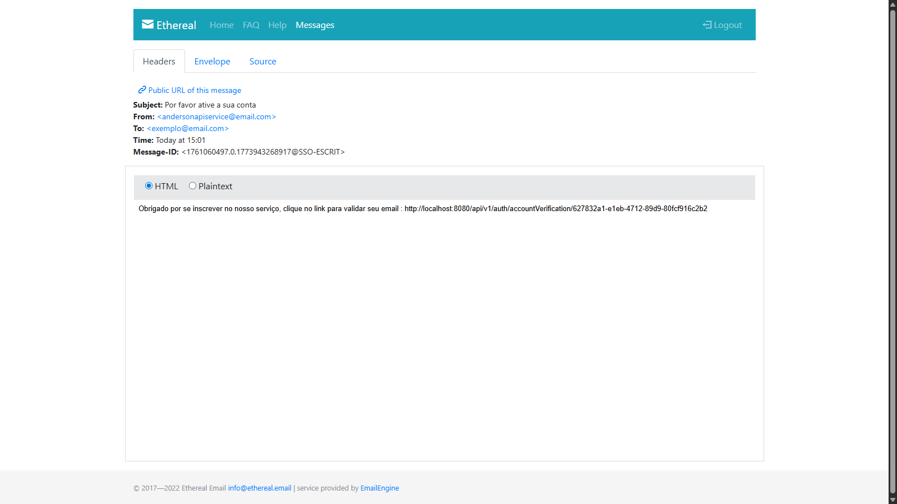
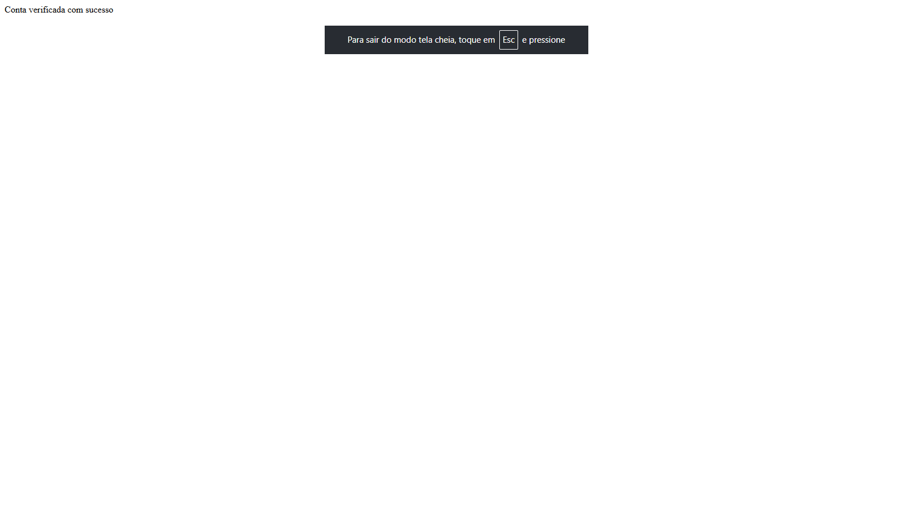
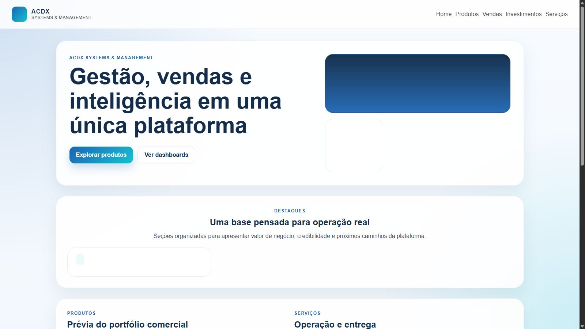
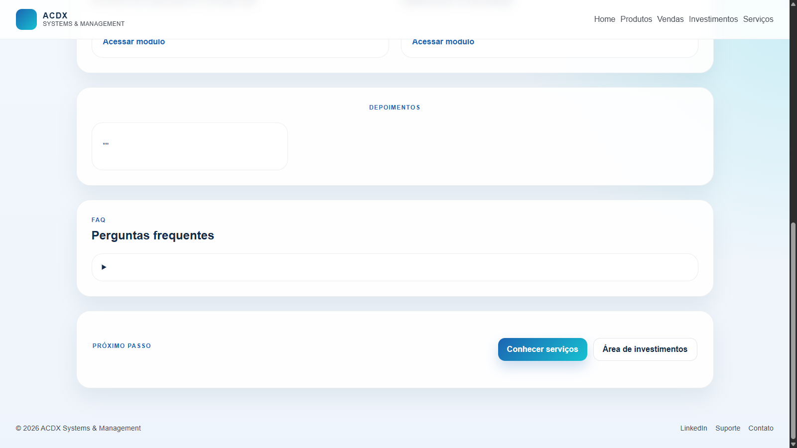
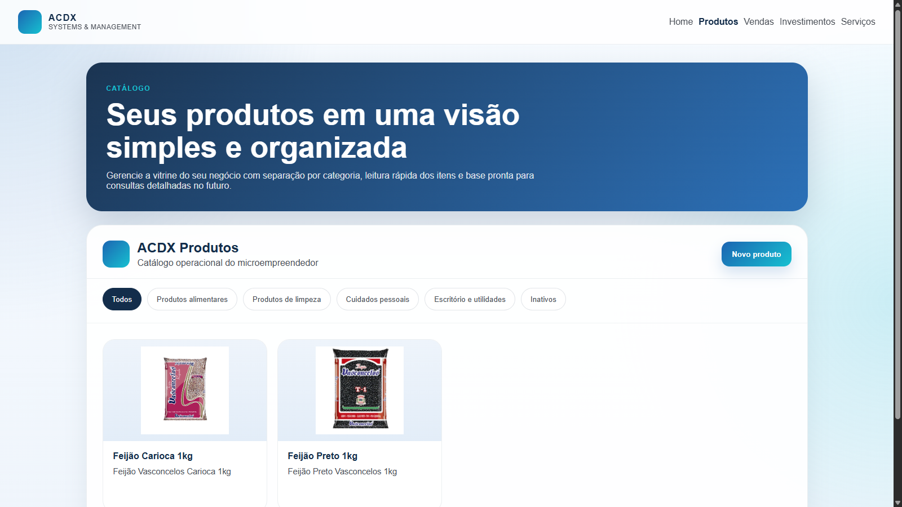
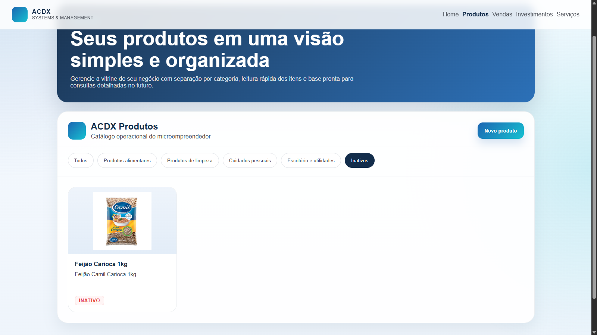
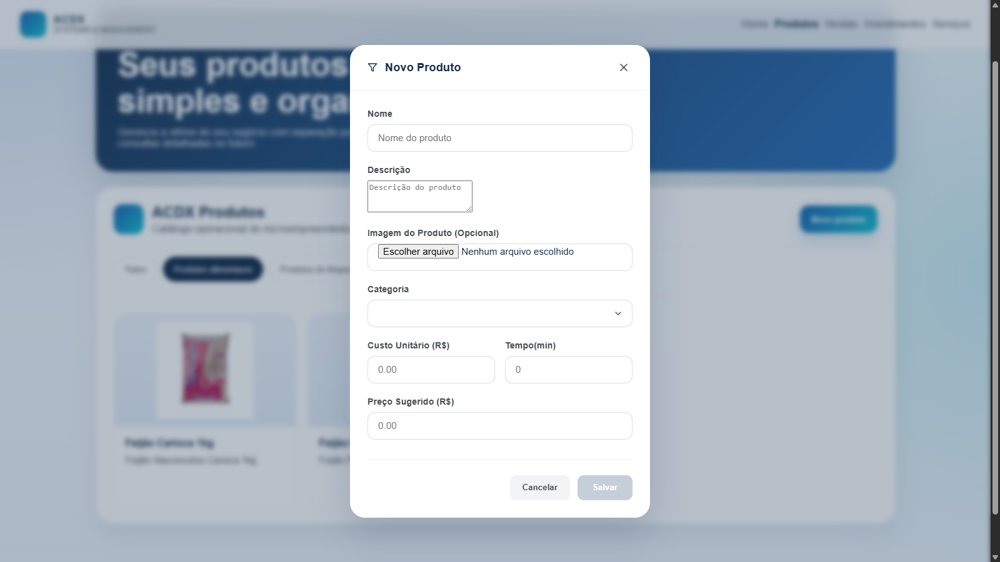
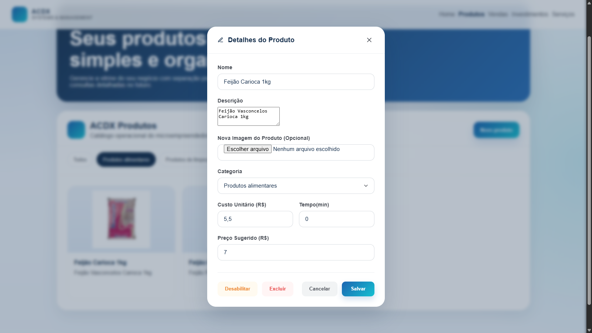

<div align="center">

# 🚀 ACDX V2 — Front-end

> Projeto de estudo e desenvolvimento de uma aplicação web Angular com Server-Side Rendering (SSR).


---


</div>

---

## 📋 Sobre o Projeto

Este repositório contém o **front-end** da aplicação **ACDX Teste**, desenvolvida com Angular 21 e suporte a **Server-Side Rendering (SSR)** utilizando `@angular/ssr` e Express. O projeto faz parte de um estudo prático de desenvolvimento full-stack, integrando uma interface moderna com uma API RESTful no back-end.

O back-end da aplicação está disponível no seguinte repositório: [meu_projeto — Back-end](https://github.com/AndersonJJR/meu_projeto)

---

## ✅ Status do Projeto

| Item       | Descrição                     |
|------------|-------------------------------|
| 📌 Tipo    | Estudo / Aprendizado          |
| 🔄 Status  | EM ANDAMENTO                  |
| 🗓️ Início  | 2025                          |

---

## 🛠️ Tecnologias Utilizadas

### Front-end

| Tecnologia        | Versão   | Descrição                                    |
|-------------------|----------|----------------------------------------------|
| Angular           | ^21.2.0  | Framework principal para desenvolvimento SPA |
| TypeScript        | ~5.9.2   | Superset tipado do JavaScript                |
| RxJS              | ~7.8.0   | Programação reativa com Observables          |
| SCSS              | —        | Pré-processador CSS para estilização         |
| @angular/ssr      | ^21.2.1  | Server-Side Rendering com Angular            |
| @angular/router   | ^21.2.0  | Roteamento entre páginas da aplicação        |
| @angular/forms    | ^21.2.0  | Gerenciamento de formulários reativos        |

### Servidor / SSR

| Tecnologia | Versão  | Descrição                              |
|------------|---------|----------------------------------------|
| Express    | ^5.1.0  | Servidor HTTP para servir o SSR        |
| Node.js    | —       | Ambiente de execução do servidor       |

### Ferramentas de Desenvolvimento

| Ferramenta   | Versão   | Descrição                                    |
|--------------|----------|----------------------------------------------|
| Angular CLI  | ^21.2.1  | Interface de linha de comando do Angular     |
| Prettier     | ^3.8.1   | Formatador de código                         |
| Vitest       | ^4.0.8   | Framework de testes unitários                |
| npm          | 11.9.0   | Gerenciador de pacotes                       |

---

## 📁 Estrutura do Projeto

```
acdx-teste/
├── src/
│   ├── app/              # Módulos, componentes, serviços e rotas
│   ├── assets/           # Arquivos estáticos (imagens, ícones, etc.)
│   ├── styles.scss       # Estilos globais da aplicação
│   ├── main.ts           # Ponto de entrada do client-side
│   ├── main.server.ts    # Ponto de entrada do server-side (SSR)
│   ├── server.ts         # Configuração do servidor Express (SSR)
│   └── index.html        # Template HTML principal
├── public/               # Arquivos públicos
├── angular.json          # Configurações do Angular CLI
├── tsconfig.json         # Configurações do TypeScript
├── package.json          # Dependências do projeto
└── README.md
```

---

## ⚙️ Pré-requisitos

Antes de começar, certifique-se de ter as seguintes ferramentas instaladas:

- [Node.js](https://nodejs.org/) (versão LTS recomendada)
- [npm](https://www.npmjs.com/) (v11+)
- [Angular CLI](https://angular.io/cli) (v21+)

---

## 🚀 Como Executar o Projeto

### 1. Clone o repositório

```bash
git clone https://github.com/AndersonJJR/acdx-teste.git
cd acdx-teste
```

### 2. Instale as dependências

```bash
npm install
```

### 3. Execute em modo de desenvolvimento

```bash
npm start
# ou
ng serve
```

Acesse: [http://localhost:4200](http://localhost:4200)

### 4. Build de produção

```bash
npm run build
```

### 5. Executar com SSR (Server-Side Rendering)

```bash
npm run build
npm run serve:ssr:acdx-teste
```

### 6. Executar testes

```bash
npm run test
```

---

## 📸 Capturas de tela

### Fluxo da aplicação

<p align="center">
  
  
  
</p>

<p align="center">
  
  
  
</p>

<p align="center">
  
  
  
</p>

<p align="center">
  
  
</p>


## 🔗 Repositório Back-end

Este projeto consome a API desenvolvida em Java Spring Boot disponível em:

👉 [https://github.com/AndersonJJR/meu_projeto](https://github.com/AndersonJJR/meu_projeto)

Certifique-se de que o back-end está rodando antes de iniciar o front-end em ambiente de desenvolvimento.

---

## 👤 Autor

<div align="center">

<!-- Substitua a URL abaixo pela sua imagem de perfil ou foto -->


**Anderson JJR**

[](https://github.com/AndersonJJR)

[](https://www.linkedin.com/in/andersonchavesjunior/)

</div>

---

<div align="center">
  <p>Feito por Anderson Júnior</p>
</div>
